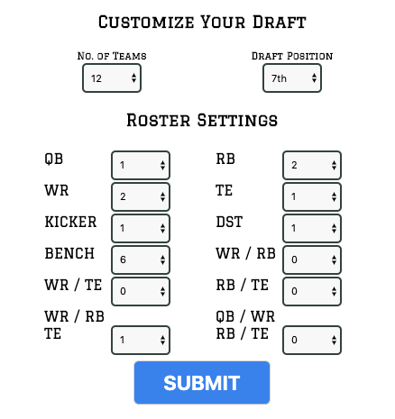
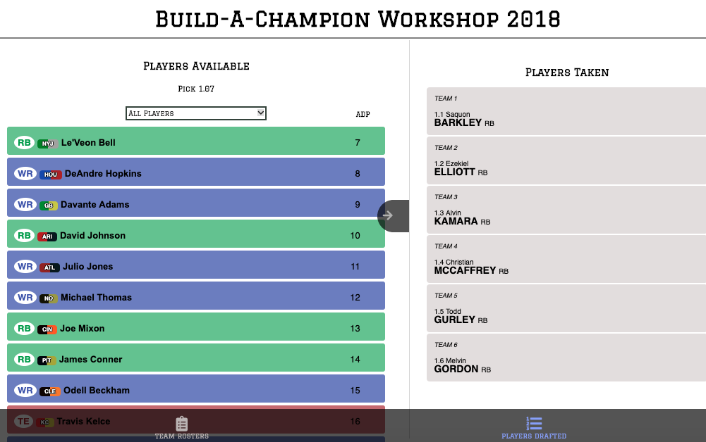
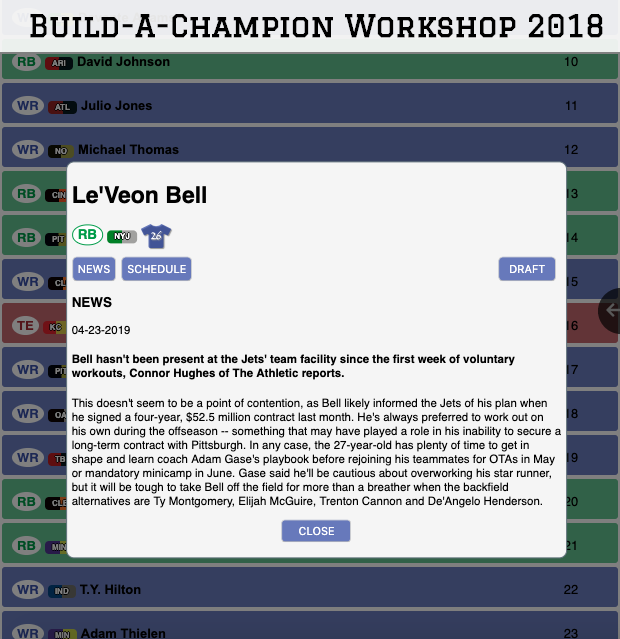
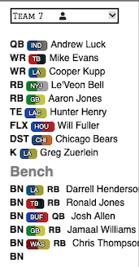

# Build-A-Champion Workshop

Practice for the upcoming NFL fantasy season by doing mock drafts until your fingers bleed.

The NFL API is currently undergoing maintenance and the app will be back up shortly at [Build-A-Champion Workshop](https://romantic-yonath-4a367e.netlify.app/).

### Begin by inputing your league settings and your draft position

You may also just click submit to begin with standard settings

### All of the players will be listed to you in order of best to worst.

You can sort players by position and see who has already been drafted on the right side of the screen.

### Once you find a player you like, simply click on their name to see more

This will bring up detailed player information such as most recent news, schedule, and even jersey number. If you like what you see, simply click draft to add him to your team

### You can switch views with the bottom tabs

And check out what each team looks like

### And that's about all there is to it. Thanks for reading and happy drafting!!
